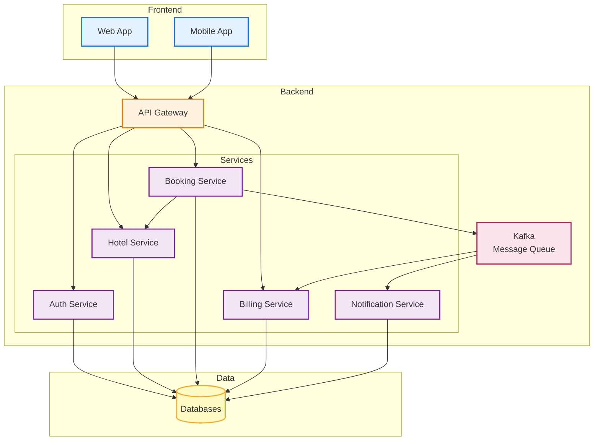

# Hotel Management System - Simple Architecture Diagram

Simple high-level architecture showing frontend and backend integration.

---

## Simple Flow Explanation

### 1. **Frontend** → User Interface (Web/Mobile Apps)
   - Users interact with the application

### 2. **API Gateway** → Single Entry Point
   - Receives all requests from frontend
   - Routes to appropriate services

### 3. **Services** → Business Logic
   - **Auth Service**: Login, Registration
   - **Hotel Service**: Hotels & Rooms
   - **Booking Service**: Bookings & Availability
   - **Billing Service**: Bills & Payments
   - **Notification Service**: Emails & SMS

### 4. **Kafka** → Event Messaging
   - Booking Service sends events
   - Billing & Notification Services listen to events

### 5. **Databases** → Data Storage
   - Each service stores its own data

---

## Key Features

✅ **Simple & Clean**: Easy to understand architecture  
✅ **Microservices**: Independent services  
✅ **Event-Driven**: Asynchronous processing via Kafka  
✅ **Scalable**: Each component can scale independently  
✅ **Secure**: API Gateway handles authentication

